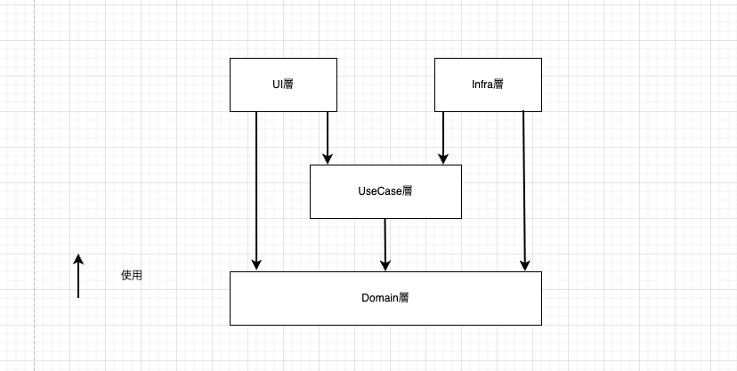
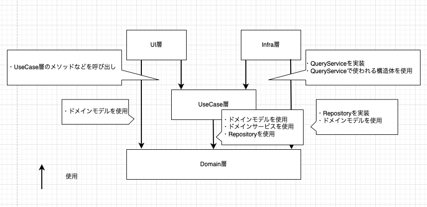

# ソフトウェアアーキテクチャ

```bash
.
├── app
│   ├── config
│   ├── server
│   ├── domain
│   │   ├── object
│   │   ├── repository
│   │   └── service
│   ├── infra
│   ├── ui
│   └── usecase
│       ├── query
│       └── user
```

今回の Yatter では以下のような層分けをしています





※これらの図は Google Drive に.drawio ファイルとして保存してあります[^1]

これらの層分けは DMM でよく使用されるアーキテクチャとなっており、事業部に所属した後もなるべく違和感がないようにこのようにしています  
部署によって細かい部分で違う箇所はあると思いますが大枠は同じなはずです  
（そのため、Yatter を実装する上では冗長に感じる記述も多くあると思います）

また、Yatter のソフトウェアアーキテクチャは [DDD ベースアーキテクチャ設計ガイドライン](https://confl.arms.dmm.com/pages/viewpage.action?pageId=2083412478) を参考にしています  
(ただ、値オブジェクトだったりの扱いは研修用に簡略化しています)

#### config

サーバーの設定をまとめたパッケージです。DB や listen するポートなどの設定を取得する API がまとめてあります

#### server

HTTP サーバーの初期化と起動を担当するパッケージです。ルーティングやミドルウェアの設定を行います

## UI 層(Presentation 層)

クライアントとのやり取りを行う層です  
Presentation 層とも呼ばれます

例.

- API サーバーとしてリクエスト元との JSON の変換処理
- バッチ処理で実行するための CLI としての標準入出力の変換処理

より具体的に、Yatter では以下のような使い方を想定しています

- クライアントとのリクエストやレスポンスの構造体を定義
- UseCase 層の結果によって HTTP ステータスで何を返すか決める
- など

## UseCase 層

システムの振る舞いであるユースケースを処理する層です

例.

- 参照系
  - タイムライン取得
  - ユーザー取得
  - あるユーザーのツイート一覧取得
- 更新系
  - ユーザー新規登録
  - ツイート投稿
  - ユーザープローフィール更新

などの多くのユースケースがあり、それらを実装していきます

また、参照系と更新系で実装方針が分かれています  
参照系は QueryService を、更新系は Repository を使って DB にアクセスします

### usecase/query

app/usecase/query ディレクトリの中に参照系の処理を記述します

ここでは QueryService のインターフェースを用意します  
トランザクションを使わない参照系は全て QueryService のメソッドとして扱います

例.

```go
type TimeLineQueryService interface {
    FetchTimeLine(...) (...)
    FetchTimeLineOnlyFollowings(...) (...)
}
```

このインターフェースを実装する構造体は Infra 層に用意します

## Domain 層

業務ロジックを実現する層です  
業務ロジックはなるべく純粋関数として用意し、単体テストをしやすくします

業務ロジックの例.

- ツイートできる文字数は 140 字以内
- ユーザープロフィールの自己紹介文は 500 字以内
- `@alice` のようなユーザー名は重複しない

このように Domain 層を独立させることで業務ロジックを変更しやすくしています
ただ、Yatter では業務ロジックが変わることは少ないので恩恵は得づらいかもしれません（特に SNS のようなアプリだと頻繁に業務ロジックが変わることは少ないと思います）

<details><summary>コラム: 技術駆動パッケージングについて</summary>

Yatter での Domain 層は domain/object, domain/repository, domain/service のようになっています  
しかし、これは技術駆動パッケージングと呼ばれるアンチパターンでもあります（設計を固めた後に気づきました）

https://x.com/MinoDriven/status/1148960876201836546

この方がいろんなプロダクトで一般的に適用できるという意見もあったりしますが、今にして思えば domain/user, domain/auth のように分ければ良かったなと思っています

</details>

### domain/object

app/domain/object ディレクトリの中にエンティティと呼ばれる構造体や処理を記述します

object/user/user.go のようにディレクトリ名とファイル名が一致するものに書かれているのがエンティティと呼ばれる構造体です  
エンティティは値オブジェクトの組み合わせで成り立っています

今回、Yatter では厳密に値オブジェクトのパターンを踏襲していません。  
ユーザー ID ごと、ユーザー名ごと型を個別に定義しても良かったのですが、研修用にしては複雑さが増えてしまうのでは？という疑問が講師陣で話していて浮かびました

そのため、ユーザー用の構造体は定義し、SetUserID のようにセッター関数を用意することで簡略化しつつバリデーションを実装することにしています

ここでの業務ロジックはバリデーション処理がほとんどです

<details><summary>コラム: Goでの値オブジェクトの実装方法について</summary>

以下ブログが参考になるかと思います

- https://tech.yyh-gl.dev/blog/go-ddd-entity-vo/

個人的にも

- domain/user/object/user.go(ここにエンティティ)
- domain/user/object/id.go(値オブジェクト)
- domain/user/object/name.go(値オブジェクト)

のようにするのがいいかなぁと思っています

</details>

### domain/repository

Repository はドメインモデルと DB とのマッピングを行うものです  
無限のメモリを持った配列として認識すると良いと思います

```go
package repository

type User interface {
    FindByUserID(...) (...)
    FindByUsername(...) (...)
    Insert(...) (...)
}
```

このインターフェースを実装する構造体は Infra 層に用意します  
また、全て更新系で使われるように限定し、引数や返り値などに domain/aggregate の構造体を使用します(更新の中で必要な取得処理とかであれば、引数には `UserID` 値オブジェクトを使います)

DB ロジックが Domain 層の業務ロジックと混ざってしまうと、いざロジックを変更しようとしたときに難しくなってしまいます  
そのため、Repository というインターフェースを用意して DB へ投げる SQL クエリなどは Infra 層に任せます

また、Yatter では DB の抽象化しかしていませんが、今後 Google Cloud Storage に画像をアップロードするために API を叩く必要が出てきたら domain/repository/storage を作り別途抽象化するかもしれません

Repository に全ての抽象化を任せてしまうと DB のロールバックや API のリトライ処理など失敗時のエラーハンドリングが難しくなってしまうため粒度は大きすぎないように分けたいです

### domain/service

ドメインモデルのみだと実現できない業務ロジックを記述します

例.

- ユーザー名の重複判定処理をユーザー自身が持っているとちょっとおかしいのでドメインサービスに括り出す
- ユーザー ID 発行処理をユーザー ID 自体に持たせても良いが、テストしやすくするためにドメインサービスに括り出す

バリデーションロジックや保存時の処理などは全てドメインサービスに書こうと思えば書けてしまいます  
ただ、ドメインサービスを使いすぎるとなんでもかんでもドメインサービスになってしまうので極力避けたいです(ここら辺の判断は難しいと思います..)

## Infra 層

主に DB などの外部とのやりとりを行う層です

UseCase 層の QueryService や Domain 層の Repository といったインターフェースを実装する構造体を記述します

外部サービスとの連携のために API を叩く必要が出てきたらそれも Infra 層に実装を記述します

例.

- ツイートのリンクがクリックされた際に外部サービスのトラッキング集計 API を叩く
- 自社の別部署が管理している会員ログイン API を叩く

---

[^1]: [YatterBE/Drawio - Google Drive](https://drive.google.com/drive/folders/1b2xEgedT07AOrqmdfcfT77wq1hmMm96z)
